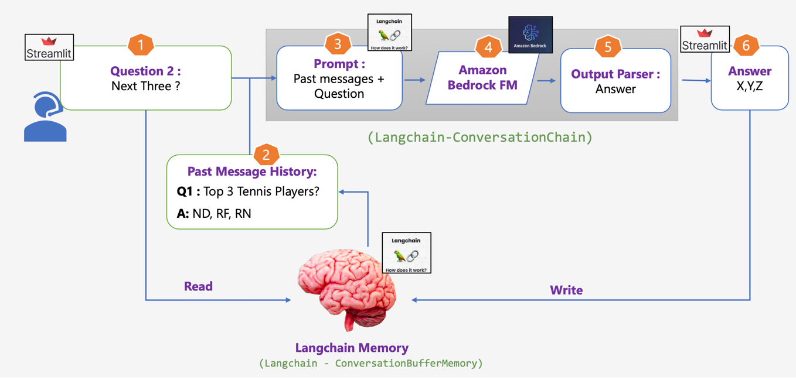

# Chatbot with Message History



This folder contains the implementation of a chatbot with message history capabilities. The chatbot uses Meta's Llama3 model through AWS Bedrock and is built with Streamlit for the frontend and custom Python classes for the backend.

## Table of Contents
- [Overview](#overview)
- [Architecture](#architecture)
- [Setup](#setup)
  - [Prerequisites](#prerequisites)
  - [Installation](#installation)
  - [Environment Variables](#environment-variables)
  - [Running the App](#running-the-app)
- [Files](#files)
- [Usage](#usage)

## Overview
The chatbot allows users to interact with a conversational AI model, maintaining session-specific chat history to provide contextually relevant responses. The chatbot backend leverages AWS Bedrock to access the Llama3 model for generating responses, with a frontend built using Streamlit.

## Architecture
1. **Frontend**: Built using Streamlit, provides a user interface for interaction.
2. **Backend**: 
   - **Session History Management**: Handles the session-specific chat history.
   - **ChatBotBackend**: Interfaces with AWS Bedrock to get responses from the Llama3 model.

## Setup

### Prerequisites
- Python 3.7+
- An AWS account with access to Bedrock and necessary permissions
- Streamlit library
- Other dependencies listed in `requirements.txt`

### Installation
1. **Clone the repository**:
    ```sh
    git clone https://github.com/yourusername/chatbot.git
    cd chatbot
    ```

2. **Create a virtual environment and activate it**:
    ```sh
    python -m venv venv
    source venv/bin/activate  # On Windows, use `venv\Scripts\activate`
    ```

3. **Install the required dependencies**:
    ```sh
    pip install -r requirements.txt
    ```

### Environment Variables
Set up the environment variables needed for AWS Bedrock and other configurations.

- `AWS_PROFILE_NAME`: The AWS CLI profile name to use (default: `default`).
- `AWS_MODEL_ID`: The ID of the model to use from Bedrock (default: `meta.llama3-8b-instruct-v1:0`).

### Running the App
To start the Streamlit app:

```sh
streamlit run streamlit_app.py
```

### Files
- `streamlit_app.py`: The main file for the Streamlit frontend. It initializes the chat interface, manages session state, and interacts with the backend to get responses.
- `chatbot_backend.py`: Contains the backend logic for the chatbot. It includes classes for managing session history and interfacing with AWS Bedrock.

### Usage
1. Start the Streamlit app and open the provided URL in a web browser.
2. Enter your question in the input field and press Enter.
3. View the chatbot's response in the chat window. The chatbot maintains the conversation's context using session history.

