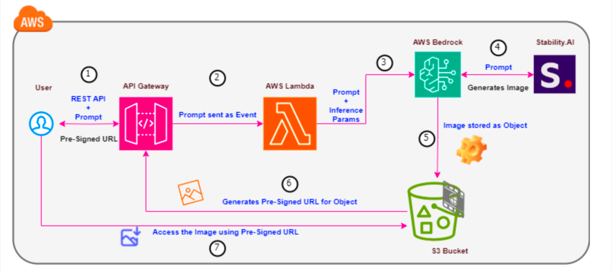

# Poster Generation with Stability's Stable Diffusion Model



This folder contains the implementation of a poster generation service using Stability's Stable Diffusion model, hosted on AWS Bedrock. The service allows users to generate images based on a provided prompt and access the generated images via a pre-signed URL.

## Table of Contents
- [Overview](#overview)
- [Architecture](#architecture)
- [Setup](#setup)
  - [Step 1: Create an S3 Bucket](#step-1-create-an-s3-bucket)
  - [Step 2: Create an AWS Lambda Function](#step-2-create-an-aws-lambda-function)
  - [Step 3: Create a REST API using AWS API Gateway](#step-3-create-a-rest-api-using-aws-api-gateway)
  - [Step 4: Test Using Postman API Tool](#step-4-test-using-postman-api-tool)
- [Files](#files)

## Overview
The service generates posters based on text prompts using the Stable Diffusion model. It consists of an AWS Lambda function that interfaces with AWS Bedrock to generate images, stores them in an S3 bucket, and provides a pre-signed URL for accessing the images.

## Architecture
1. **S3 Bucket**: Stores the generated images.
2. **AWS Lambda Function**: Executes the image generation and handles the interactions with Bedrock and S3.
3. **AWS API Gateway**: Provides a REST API for users to submit prompts and retrieve the generated images.

## Setup

### Step 1: Create an S3 Bucket
Create an S3 bucket to store the generated images.

1. Navigate to the [AWS S3 Console](https://console.aws.amazon.com/s3/).
2. Click on "Create bucket."
3. Name your bucket `movieposterdesign01` and configure settings as needed.
4. Click "Create bucket."

### Step 2: Create an AWS Lambda Function
Create a Lambda function to generate images using the Stable Diffusion model and interact with S3.

1. Navigate to the [AWS Lambda Console](https://console.aws.amazon.com/lambda/).
2. Click "Create function."
3. Choose "Author from scratch."
4. Set the function name to `moviePosterDesignFunction`.
5. Select Python as the runtime.
6. Click "Create function."

**Configure the Lambda Function:**

- **Handler:** Set the handler to `lambda_function.lambda_handler`.
- **Code:** Upload the `lambda_function.py` file provided in this folder.

**Permissions:**

1. Assign an IAM role with the necessary permissions for S3, Bedrock, and logging.

**Environment Variables:**

- Add environment variables for any necessary configuration, such as S3 bucket name, API keys, etc.

### Step 3: Create a REST API using AWS API Gateway
Set up an API Gateway to allow users to interact with the Lambda function.

1. Navigate to the [AWS API Gateway Console](https://console.aws.amazon.com/apigateway/).
2. Click "Create API" and select "REST API."
3. Name your API `movePosterDesignAPI`.

**Setup Resources and Methods:**

1. Create a new resource with a suitable path (e.g., `/generate-poster`).
2. Create a POST method for this resource.
3. Set the integration type to Lambda Function and link it to the `moviePosterDesignFunction`.

### Step 4: Test Using Postman API Tool
1. Open Postman and create a new request.
2. Set the request type to POST and enter the API endpoint URL generated by API Gateway.
3. In the request body, provide a JSON object with the prompt:
    ```json
    {
      "prompt": "A futuristic city skyline at sunset"
    }
    ```
4. Send the request and view the pre-signed URL for the generated image in the response.

## Files

- **`lambda_function.py`**: Contains the code for the AWS Lambda function that interfaces with the Stable Diffusion model, stores the generated images in S3, and returns a pre-signed URL.
