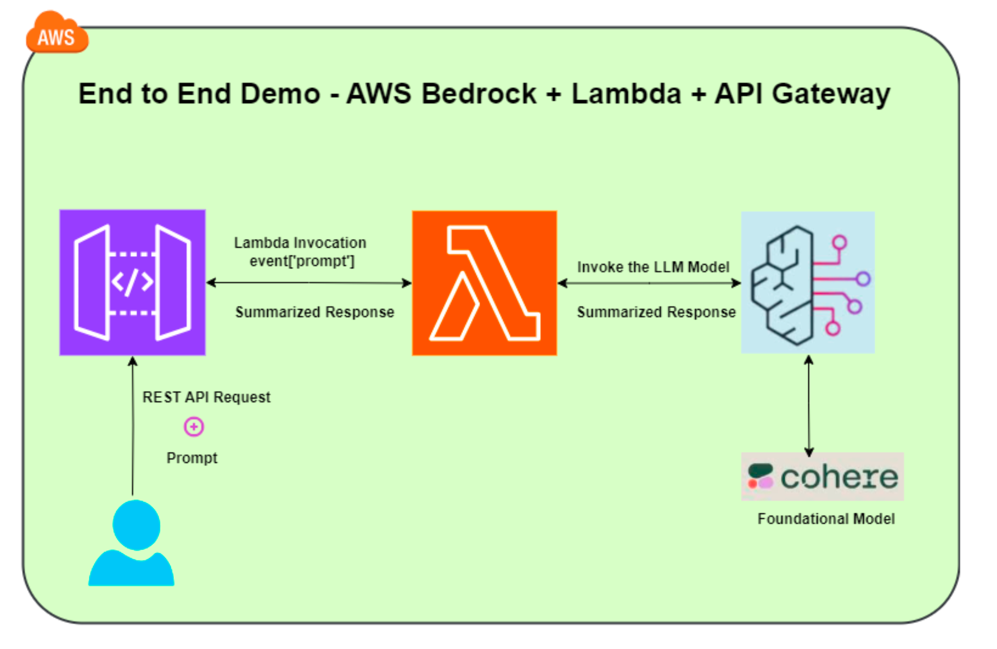

# Summarization of Manufacturing Logs with Cohere's Command Model



This folder contains the implementation of a summarization service for manufacturing logs using Cohere's Command model on AWS Bedrock. The service is accessible via a REST API and can process text prompts to generate summaries.

## Table of Contents
- [Overview](#overview)
- [Architecture](#architecture)
- [Setup](#setup)
  - [Step 1: Create an IAM Role and Increase Timeout Limit](#step-1-create-an-iam-role-and-increase-timeout-limit)
  - [Step 2: Code for Bedrock Invocation from AWS Lambda Function](#step-2-code-for-bedrock-invocation-from-aws-lambda-function)
  - [Step 3: Configure Test Event](#step-3-configure-test-event)
  - [Step 4: Create a REST API from API Gateway](#step-4-create-a-rest-api-from-api-gateway)
    - [Resource](#resource)
    - [Method - POST](#method---post)
  - [Step 5: API Gateway - Method Request](#step-5-api-gateway---method-request)
  - [Step 6: API Gateway - Integration Request](#step-6-api-gateway---integration-request)
  - [Step 7: Deploy the API to a Stage](#step-7-deploy-the-api-to-a-stage)
  - [Step 8: Test Using API Gateway Console](#step-8-test-using-api-gateway-console)
- [Files](#files)

## Overview
The summarization service leverages Cohere's Command model for natural language processing tasks, specifically focusing on summarizing manufacturing logs. The service is implemented using AWS Lambda and exposed via an API Gateway REST API.

## Architecture
1. **IAM Role**: Provides necessary permissions for the Lambda function.
2. **AWS Lambda Function**: Executes the summarization logic using Cohere's Command model.
3. **API Gateway**: Serves as the endpoint for client requests.

## Setup

### Step 1: Create an IAM Role and Increase Timeout Limit
1. **Create an IAM Role**:
   - Navigate to the [IAM Console](https://console.aws.amazon.com/iam/).
   - Create a new role with permissions for Lambda, Bedrock, and logging.
   - Attach policies such as `AWSLambdaBasicExecutionRole`.

2. **Increase Timeout Limit**:
   - In the Lambda function's configuration, set the timeout limit to an appropriate value to accommodate the summarization process.

### Step 2: Code for Bedrock Invocation from AWS Lambda Function
The code for invoking Bedrock's Cohere Command model is implemented in the `lambda_function.py` file. This script handles the input prompt, calls the Cohere model, and returns the summarized text.

### Step 3: Configure Test Event
Configure a test event to validate the Lambda function.

1. In the AWS Lambda Console, go to the function's Test tab.
2. Create a new test event with the following JSON:
    ```json
    {
      "prompt": "How is weather in Bengaluru"
    }
    ```
3. Save and test the function.

### Step 4: Create a REST API from API Gateway

#### Resource
1. Navigate to the [API Gateway Console](https://console.aws.amazon.com/apigateway/).
2. Create a new REST API.
3. Create a new resource named `demoManufacturing`.

#### Method - POST
1. Under the `demoManufacturing` resource, create a new POST method.
2. Set the integration type to Lambda Function and select the `lambda_function.py` from the list.

### Step 5: API Gateway - Method Request
1. In the Method Request section, add a URL query string parameter named `prompt`.

### Step 6: API Gateway - Integration Request
1. Set the request body mapping template to `application/json`.
2. Use the following template:
    ```json
    {
      "prompt": "$input.params('prompt')"
    }
    ```

### Step 7: Deploy the API to a Stage
1. In the API Gateway Console, select "Deploy API."
2. Create a new stage or select an existing one.
3. Deploy the API.

### Step 8: Test Using API Gateway Console
1. Navigate to the deployed stage in the API Gateway Console.
2. Copy the Invoke URL.
3. Test the API by sending a POST request to the URL with a query parameter `prompt`.

## Files

- **`lambda_function.py`**: Contains the code for the AWS Lambda function that invokes Cohere's Command model to summarize text prompts.
