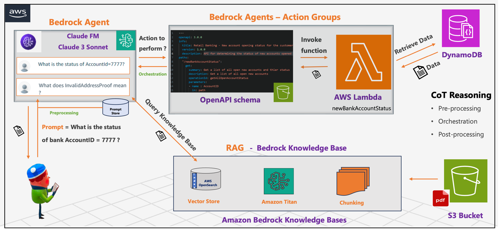

# Building a Retail Bank Agent using Bedrock Agents and Knowledge Base

This folder contains the implementation of a retail bank agent that allows users to inquire about the status of their bank accounts. The agent is built using AWS Bedrock Agents, DynamoDB for storing account details, and an OpenAPI schema for defining agent actions.

## Table of Contents
- [Overview](#overview)
- [Architecture](#architecture)
- [Setup](#setup)
  - [Step 1: Create a DynamoDB Table](#step-1-create-a-dynamodb-table)
  - [Step 2: Create an AWS Lambda Function](#step-2-create-an-aws-lambda-function)
  - [Step 3: Define OpenAPI Schemas and Upload to S3](#step-3-define-openapi-schemas-and-upload-to-s3)
  - [Step 4: Create the Bedrock Agent](#step-4-create-the-bedrock-agent)
  - [Step 5: Update Lambda Function Permissions](#step-5-update-lambda-function-permissions)
  - [Step 6: Create Bedrock Knowledge Base and Update Action Group](#step-6-create-bedrock-knowledge-base-and-update-action-group)
  - [Step 7: Test the Agent](#step-7-test-the-agent)
- [Files](#files)

## Overview
The bank agent provides a conversational interface for customers to check their account status. It retrieves information from a DynamoDB table containing account details and utilizes an OpenAPI schema to define available actions.

## Architecture
1. **DynamoDB**: Stores customer account details.
2. **AWS Lambda Function**: Retrieves account data from DynamoDB.
3. **Bedrock Agent**: Handles customer queries and interacts with the Lambda function.
4. **Knowledge Base**: Provides additional information for the agent.

## Setup

### Step 1: Create a DynamoDB Table
1. Go to the [DynamoDB Console](https://console.aws.amazon.com/dynamodb/).
2. Create a new table named `customerAccountStatus`.
3. Define appropriate attributes for the table (e.g., `AccountID` as the primary key).

### Step 2: Create an AWS Lambda Function
1. Go to the [Lambda Console](https://console.aws.amazon.com/lambda/).
2. Create a new function named `newBankAccountStatus`.
3. Add the code to retrieve data from the `customerAccountStatus` DynamoDB table. The implementation is available in the `lambda_function.py` file.

### Step 3: Define OpenAPI Schemas and Upload to S3
1. Define the OpenAPI schema for the agent action group.
2. Upload the OpenAPI schema file to an S3 bucket named `accountstatusopenapi`.

### Step 4: Create the Bedrock Agent
1. Navigate to the Bedrock Console.
2. Create a new agent named `bankofchicago-agent`.
3. Configure the agent to use the OpenAPI schema from the S3 bucket.

### Step 5: Update Lambda Function Permissions
1. Go to the [Lambda Console](https://console.aws.amazon.com/lambda/).
2. Select the `newBankAccountStatus` function.
3. Add a resource-based policy with the following details:
   - **Service**: Other
   - **Statement ID**: `bedrock-agent`
   - **Principal**: `bedrock.amazonaws.com`
   - **Source ARN**: `arn:aws:bedrock:us-west-2:719386081370:agent/UZ41MX12CO`
   - **Action**: `lambda:InvokeFunction`

### Step 6: Create Bedrock Knowledge Base and Update Action Group
1. Create a Knowledge Base in Bedrock for the agent.
2. Update the action group in the OpenAPI schema to include the Knowledge Base details.
3. Upload the updated OpenAPI schema to the S3 bucket `bankingagentknowledgebase`.

### Step 7: Test the Agent
1. Use the Bedrock Console or a suitable client to interact with the `bankofchicago-agent`.
2. Verify that the agent can correctly retrieve and present account status information.

## Files

- **`lambda_function.py`**: Contains the code for the AWS Lambda function that retrieves account data from DynamoDB.
